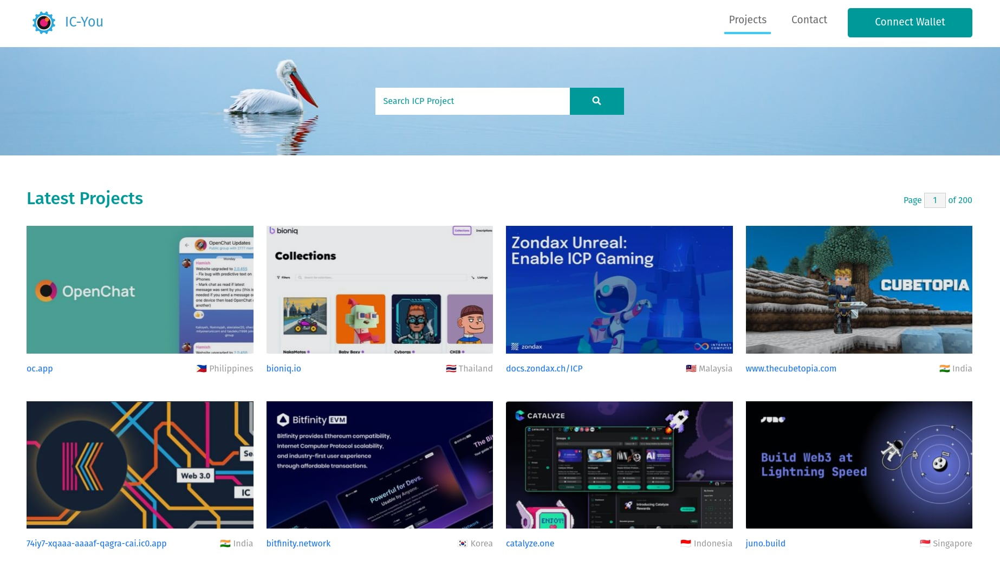

# IC-You

IC-You is an on-chain active directory of ICP projects by the community, for the community.


## 🚀 How to start

When the editor opened, run the following commands to start a local ICP node and deploy the canister smart contract:

```bash
dfx start --clean # Start a local ICP node
# In a new terminal window:
dfx deploy # Deploy smart contract locally

dfx deploy --network ic --no-wallet # Deploy to mainnet
```

## Screenshot

